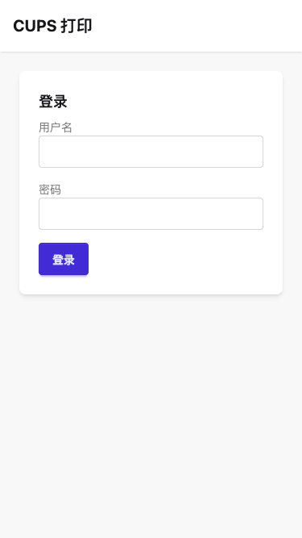
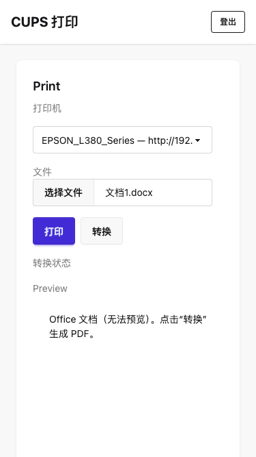
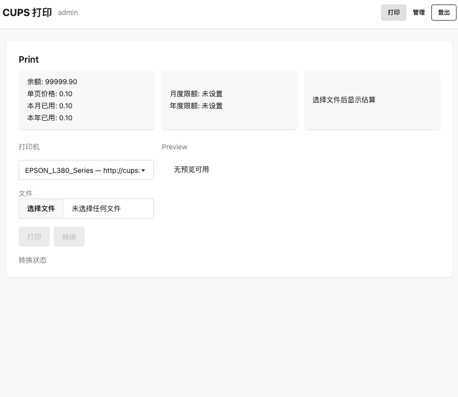
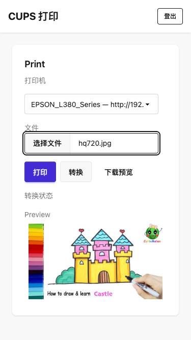

# 🖨️ CUPS Web - 网页打印机

[](https://hub.docker.com/r/hanxi/cups-web)
[](https://github.com/hanxi/cups-web)
[](LICENSE)


这是一个简单易用的网页版打印机管理工具。它允许你通过浏览器远程控制家里的打印机，轻松上传并打印文件，从而替代繁琐的远程桌面操作。

## 📸 界面预览

<div align="center">

<table>
  <tr>
    <td align="center">
      <br/>
      <b>登录认证</b>
    </td>
    <td align="center">
      <br/>
      <b>打印机列表</b>
    </td>
  </tr>
  <tr>
    <td align="center">
      <br/>
      <b>文件上传</b>
    </td>
    <td align="center">
      <br/>
      <b>打印任务</b>
    </td>
  </tr>
</table>

</div>

## ✨ 功能特点

- **远程打印**：随时随地通过网页上传文件进行打印。
- **格式支持**：除了常见的图片和 PDF，还支持 **Office 文档** (docx, xlsx, ppt 等) 自动转换为 PDF 并打印 (基于 LibreOffice)。
- **安全认证**：简单的账号密码登录保护。
- **易于部署**：支持 Docker 一键部署。

## 🛠️ 技术栈

- **打印服务**: [CUPS](https://github.com/OpenPrinting/cups)
- **后端**: Go
- **前端**: Vue.js

## 🚀 快速开始 (使用 Docker)

本项目提供了 `docker-compose.yml` 文件，可以快速启动服务。

### 1. 准备环境变量

在启动之前，你需要设置一些环境变量。参考 `docker-compose.yml` 的注释修改。

`SESSION_HASH_KEY` 和 `SESSION_BLOCK_KEY` 用于加密 session，可以使用以下命令生成随机密钥：

```bash
openssl rand -base64 32 | tr -d '\n'
```

### 2. 启动服务

```bash
docker-compose up -d
```

### 3. 注意事项

- **驱动安装**: CUPS 服务建议根据自己的打印机型号安装合适的驱动。
- **LibreOffice**: 如果需要 Office 文档转 PDF 功能，服务器需安装 LibreOffice。本项目提供的 Web 镜像 (`hanxi/cups-web`) 中已经预装了 LibreOffice。
